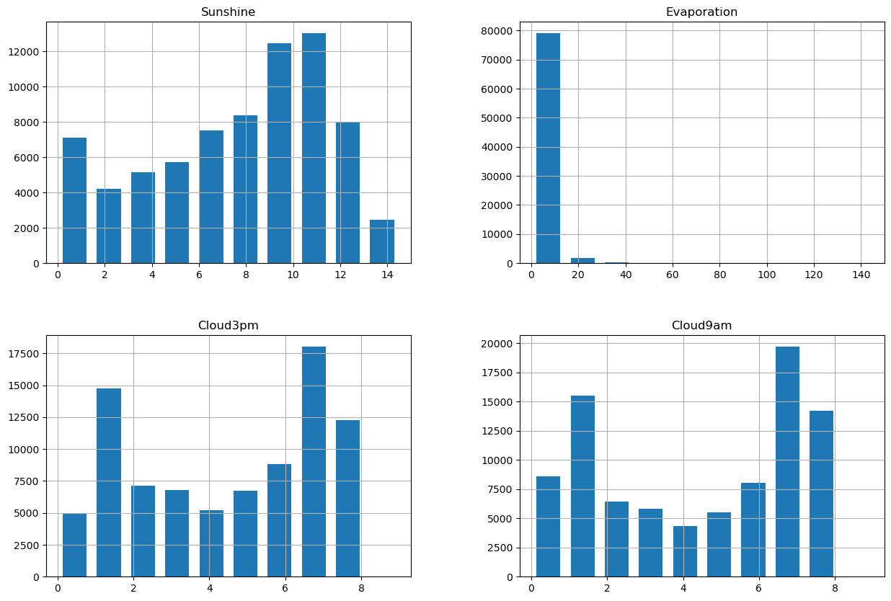
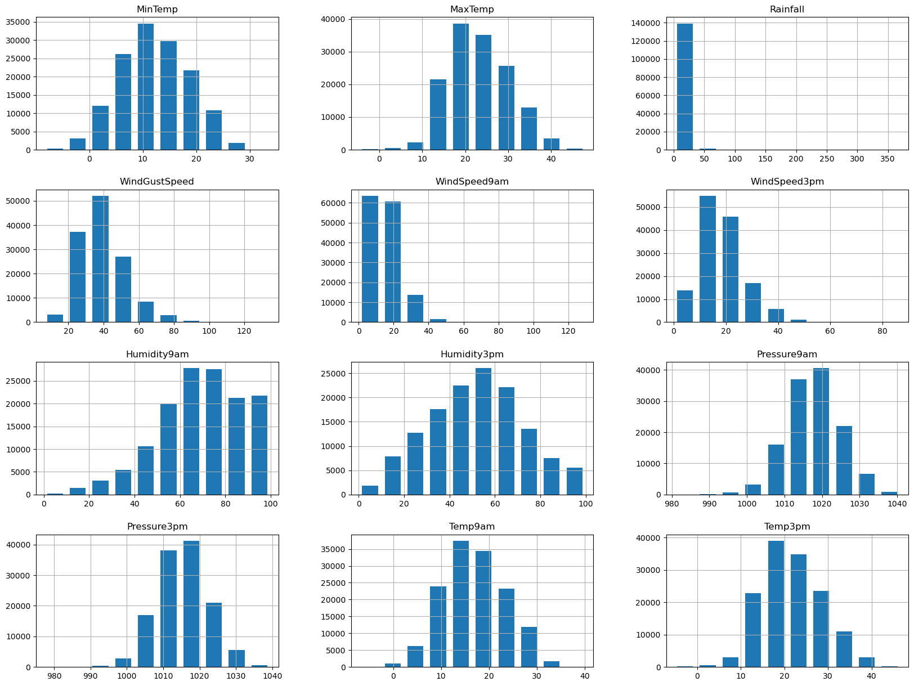
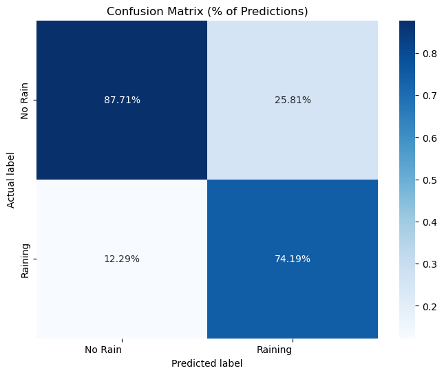

```python
import torch
import torch.nn as nn
import torch.optim as optim
from torch.utils.data import TensorDataset, DataLoader
import matplotlib.pyplot as plt
import pandas as pd
```

# 1. Import the Dataset


```python
df = pd.read_csv("weatherAUS.csv")
df
```


<div>
<style scoped>
    .dataframe tbody tr th:only-of-type {
        vertical-align: middle;
    }

    .dataframe tbody tr th {
        vertical-align: top;
    }

    .dataframe thead th {
        text-align: right;
    }
</style>
<table border="1" class="dataframe">
  <thead>
    <tr style="text-align: right;">
      <th></th>
      <th>Date</th>
      <th>Location</th>
      <th>MinTemp</th>
      <th>MaxTemp</th>
      <th>Rainfall</th>
      <th>Evaporation</th>
      <th>Sunshine</th>
      <th>WindGustDir</th>
      <th>WindGustSpeed</th>
      <th>WindDir9am</th>
      <th>...</th>
      <th>Humidity9am</th>
      <th>Humidity3pm</th>
      <th>Pressure9am</th>
      <th>Pressure3pm</th>
      <th>Cloud9am</th>
      <th>Cloud3pm</th>
      <th>Temp9am</th>
      <th>Temp3pm</th>
      <th>RainToday</th>
      <th>RainTomorrow</th>
    </tr>
  </thead>
  <tbody>
    <tr>
      <th>0</th>
      <td>2008-12-01</td>
      <td>Albury</td>
      <td>13.4</td>
      <td>22.9</td>
      <td>0.6</td>
      <td>NaN</td>
      <td>NaN</td>
      <td>W</td>
      <td>44.0</td>
      <td>W</td>
      <td>...</td>
      <td>71.0</td>
      <td>22.0</td>
      <td>1007.7</td>
      <td>1007.1</td>
      <td>8.0</td>
      <td>NaN</td>
      <td>16.9</td>
      <td>21.8</td>
      <td>No</td>
      <td>No</td>
    </tr>
    <tr>
      <th>1</th>
      <td>2008-12-02</td>
      <td>Albury</td>
      <td>7.4</td>
      <td>25.1</td>
      <td>0.0</td>
      <td>NaN</td>
      <td>NaN</td>
      <td>WNW</td>
      <td>44.0</td>
      <td>NNW</td>
      <td>...</td>
      <td>44.0</td>
      <td>25.0</td>
      <td>1010.6</td>
      <td>1007.8</td>
      <td>NaN</td>
      <td>NaN</td>
      <td>17.2</td>
      <td>24.3</td>
      <td>No</td>
      <td>No</td>
    </tr>
    <tr>
      <th>2</th>
      <td>2008-12-03</td>
      <td>Albury</td>
      <td>12.9</td>
      <td>25.7</td>
      <td>0.0</td>
      <td>NaN</td>
      <td>NaN</td>
      <td>WSW</td>
      <td>46.0</td>
      <td>W</td>
      <td>...</td>
      <td>38.0</td>
      <td>30.0</td>
      <td>1007.6</td>
      <td>1008.7</td>
      <td>NaN</td>
      <td>2.0</td>
      <td>21.0</td>
      <td>23.2</td>
      <td>No</td>
      <td>No</td>
    </tr>
    <tr>
      <th>3</th>
      <td>2008-12-04</td>
      <td>Albury</td>
      <td>9.2</td>
      <td>28.0</td>
      <td>0.0</td>
      <td>NaN</td>
      <td>NaN</td>
      <td>NE</td>
      <td>24.0</td>
      <td>SE</td>
      <td>...</td>
      <td>45.0</td>
      <td>16.0</td>
      <td>1017.6</td>
      <td>1012.8</td>
      <td>NaN</td>
      <td>NaN</td>
      <td>18.1</td>
      <td>26.5</td>
      <td>No</td>
      <td>No</td>
    </tr>
    <tr>
      <th>4</th>
      <td>2008-12-05</td>
      <td>Albury</td>
      <td>17.5</td>
      <td>32.3</td>
      <td>1.0</td>
      <td>NaN</td>
      <td>NaN</td>
      <td>W</td>
      <td>41.0</td>
      <td>ENE</td>
      <td>...</td>
      <td>82.0</td>
      <td>33.0</td>
      <td>1010.8</td>
      <td>1006.0</td>
      <td>7.0</td>
      <td>8.0</td>
      <td>17.8</td>
      <td>29.7</td>
      <td>No</td>
      <td>No</td>
    </tr>
    <tr>
      <th>...</th>
      <td>...</td>
      <td>...</td>
      <td>...</td>
      <td>...</td>
      <td>...</td>
      <td>...</td>
      <td>...</td>
      <td>...</td>
      <td>...</td>
      <td>...</td>
      <td>...</td>
      <td>...</td>
      <td>...</td>
      <td>...</td>
      <td>...</td>
      <td>...</td>
      <td>...</td>
      <td>...</td>
      <td>...</td>
      <td>...</td>
      <td>...</td>
    </tr>
    <tr>
      <th>145455</th>
      <td>2017-06-21</td>
      <td>Uluru</td>
      <td>2.8</td>
      <td>23.4</td>
      <td>0.0</td>
      <td>NaN</td>
      <td>NaN</td>
      <td>E</td>
      <td>31.0</td>
      <td>SE</td>
      <td>...</td>
      <td>51.0</td>
      <td>24.0</td>
      <td>1024.6</td>
      <td>1020.3</td>
      <td>NaN</td>
      <td>NaN</td>
      <td>10.1</td>
      <td>22.4</td>
      <td>No</td>
      <td>No</td>
    </tr>
    <tr>
      <th>145456</th>
      <td>2017-06-22</td>
      <td>Uluru</td>
      <td>3.6</td>
      <td>25.3</td>
      <td>0.0</td>
      <td>NaN</td>
      <td>NaN</td>
      <td>NNW</td>
      <td>22.0</td>
      <td>SE</td>
      <td>...</td>
      <td>56.0</td>
      <td>21.0</td>
      <td>1023.5</td>
      <td>1019.1</td>
      <td>NaN</td>
      <td>NaN</td>
      <td>10.9</td>
      <td>24.5</td>
      <td>No</td>
      <td>No</td>
    </tr>
    <tr>
      <th>145457</th>
      <td>2017-06-23</td>
      <td>Uluru</td>
      <td>5.4</td>
      <td>26.9</td>
      <td>0.0</td>
      <td>NaN</td>
      <td>NaN</td>
      <td>N</td>
      <td>37.0</td>
      <td>SE</td>
      <td>...</td>
      <td>53.0</td>
      <td>24.0</td>
      <td>1021.0</td>
      <td>1016.8</td>
      <td>NaN</td>
      <td>NaN</td>
      <td>12.5</td>
      <td>26.1</td>
      <td>No</td>
      <td>No</td>
    </tr>
    <tr>
      <th>145458</th>
      <td>2017-06-24</td>
      <td>Uluru</td>
      <td>7.8</td>
      <td>27.0</td>
      <td>0.0</td>
      <td>NaN</td>
      <td>NaN</td>
      <td>SE</td>
      <td>28.0</td>
      <td>SSE</td>
      <td>...</td>
      <td>51.0</td>
      <td>24.0</td>
      <td>1019.4</td>
      <td>1016.5</td>
      <td>3.0</td>
      <td>2.0</td>
      <td>15.1</td>
      <td>26.0</td>
      <td>No</td>
      <td>No</td>
    </tr>
    <tr>
      <th>145459</th>
      <td>2017-06-25</td>
      <td>Uluru</td>
      <td>14.9</td>
      <td>NaN</td>
      <td>0.0</td>
      <td>NaN</td>
      <td>NaN</td>
      <td>NaN</td>
      <td>NaN</td>
      <td>ESE</td>
      <td>...</td>
      <td>62.0</td>
      <td>36.0</td>
      <td>1020.2</td>
      <td>1017.9</td>
      <td>8.0</td>
      <td>8.0</td>
      <td>15.0</td>
      <td>20.9</td>
      <td>No</td>
      <td>NaN</td>
    </tr>
  </tbody>
</table>
<p>145460 rows × 23 columns</p>
</div>


# 2. Analyse the Dataset


```python
df.info()
```

    <class 'pandas.core.frame.DataFrame'>
    RangeIndex: 145460 entries, 0 to 145459
    Data columns (total 23 columns):
     #   Column         Non-Null Count   Dtype  
    ---  ------         --------------   -----  
     0   Date           145460 non-null  object 
     1   Location       145460 non-null  object 
     2   MinTemp        143975 non-null  float64
     3   MaxTemp        144199 non-null  float64
     4   Rainfall       142199 non-null  float64
     5   Evaporation    82670 non-null   float64
     6   Sunshine       75625 non-null   float64
     7   WindGustDir    135134 non-null  object 
     8   WindGustSpeed  135197 non-null  float64
     9   WindDir9am     134894 non-null  object 
     10  WindDir3pm     141232 non-null  object 
     11  WindSpeed9am   143693 non-null  float64
     12  WindSpeed3pm   142398 non-null  float64
     13  Humidity9am    142806 non-null  float64
     14  Humidity3pm    140953 non-null  float64
     15  Pressure9am    130395 non-null  float64
     16  Pressure3pm    130432 non-null  float64
     17  Cloud9am       89572 non-null   float64
     18  Cloud3pm       86102 non-null   float64
     19  Temp9am        143693 non-null  float64
     20  Temp3pm        141851 non-null  float64
     21  RainToday      142199 non-null  object 
     22  RainTomorrow   142193 non-null  object 
    dtypes: float64(16), object(7)
    memory usage: 25.5+ MB
    


```python
import numpy as np

numeric_cols = df.select_dtypes(include=np.number).columns.tolist()
categorical_cols = df.select_dtypes('object').columns.tolist()
```


```python
numeric_cols
```


    ['MinTemp',
     'MaxTemp',
     'Rainfall',
     'Evaporation',
     'Sunshine',
     'WindGustSpeed',
     'WindSpeed9am',
     'WindSpeed3pm',
     'Humidity9am',
     'Humidity3pm',
     'Pressure9am',
     'Pressure3pm',
     'Cloud9am',
     'Cloud3pm',
     'Temp9am',
     'Temp3pm']


```python
categorical_cols
```


    ['Date',
     'Location',
     'WindGustDir',
     'WindDir9am',
     'WindDir3pm',
     'RainToday',
     'RainTomorrow']


```python
# Checking how many values each column have.

df.count().sort_values()
```


    Sunshine          75625
    Evaporation       82670
    Cloud3pm          86102
    Cloud9am          89572
    Pressure9am      130395
    Pressure3pm      130432
    WindDir9am       134894
    WindGustDir      135134
    WindGustSpeed    135197
    Humidity3pm      140953
    WindDir3pm       141232
    Temp3pm          141851
    RainTomorrow     142193
    RainToday        142199
    Rainfall         142199
    WindSpeed3pm     142398
    Humidity9am      142806
    Temp9am          143693
    WindSpeed9am     143693
    MinTemp          143975
    MaxTemp          144199
    Location         145460
    Date             145460
    dtype: int64


```python
missing_values = df.isna().sum().sort_values()
num_missing_values = pd.DataFrame({'num_missing_values': missing_values})
print(num_missing_values)
```

                   num_missing_values
    Date                            0
    Location                        0
    MaxTemp                      1261
    MinTemp                      1485
    Temp9am                      1767
    WindSpeed9am                 1767
    Humidity9am                  2654
    WindSpeed3pm                 3062
    Rainfall                     3261
    RainToday                    3261
    RainTomorrow                 3267
    Temp3pm                      3609
    WindDir3pm                   4228
    Humidity3pm                  4507
    WindGustSpeed               10263
    WindGustDir                 10326
    WindDir9am                  10566
    Pressure3pm                 15028
    Pressure9am                 15065
    Cloud9am                    55888
    Cloud3pm                    59358
    Evaporation                 62790
    Sunshine                    69835
    


```python
missing_percent = df.isnull().sum() * 100 / len(df)
missing_values = pd.DataFrame({'missing_values(%)': missing_percent})
missing_values.sort_values(by ='missing_values(%)' , ascending=False)
```


<div>
<style scoped>
    .dataframe tbody tr th:only-of-type {
        vertical-align: middle;
    }

    .dataframe tbody tr th {
        vertical-align: top;
    }

    .dataframe thead th {
        text-align: right;
    }
</style>
<table border="1" class="dataframe">
  <thead>
    <tr style="text-align: right;">
      <th></th>
      <th>missing_values(%)</th>
    </tr>
  </thead>
  <tbody>
    <tr>
      <th>Sunshine</th>
      <td>48.009762</td>
    </tr>
    <tr>
      <th>Evaporation</th>
      <td>43.166506</td>
    </tr>
    <tr>
      <th>Cloud3pm</th>
      <td>40.807095</td>
    </tr>
    <tr>
      <th>Cloud9am</th>
      <td>38.421559</td>
    </tr>
    <tr>
      <th>Pressure9am</th>
      <td>10.356799</td>
    </tr>
    <tr>
      <th>Pressure3pm</th>
      <td>10.331363</td>
    </tr>
    <tr>
      <th>WindDir9am</th>
      <td>7.263853</td>
    </tr>
    <tr>
      <th>WindGustDir</th>
      <td>7.098859</td>
    </tr>
    <tr>
      <th>WindGustSpeed</th>
      <td>7.055548</td>
    </tr>
    <tr>
      <th>Humidity3pm</th>
      <td>3.098446</td>
    </tr>
    <tr>
      <th>WindDir3pm</th>
      <td>2.906641</td>
    </tr>
    <tr>
      <th>Temp3pm</th>
      <td>2.481094</td>
    </tr>
    <tr>
      <th>RainTomorrow</th>
      <td>2.245978</td>
    </tr>
    <tr>
      <th>Rainfall</th>
      <td>2.241853</td>
    </tr>
    <tr>
      <th>RainToday</th>
      <td>2.241853</td>
    </tr>
    <tr>
      <th>WindSpeed3pm</th>
      <td>2.105046</td>
    </tr>
    <tr>
      <th>Humidity9am</th>
      <td>1.824557</td>
    </tr>
    <tr>
      <th>Temp9am</th>
      <td>1.214767</td>
    </tr>
    <tr>
      <th>WindSpeed9am</th>
      <td>1.214767</td>
    </tr>
    <tr>
      <th>MinTemp</th>
      <td>1.020899</td>
    </tr>
    <tr>
      <th>MaxTemp</th>
      <td>0.866905</td>
    </tr>
    <tr>
      <th>Location</th>
      <td>0.000000</td>
    </tr>
    <tr>
      <th>Date</th>
      <td>0.000000</td>
    </tr>
  </tbody>
</table>
</div>


# 3. Preprocessing the Data

### 3.1 Discard unnecessary data

Removing rows with missing "RainToday" or "RainTomorrow" values before preprocessing can be a good idea to make analysis and modeling simpler and faster. Because I set "RainTomorrow" as the target and the other columns should be related to precipitation records.


```python
df.dropna(subset=['RainToday', 'RainTomorrow'], inplace=True)
```

There are two ways to deal with missing values, either by deleting incomplete variables if there are too many data missing or by replacing these missing values with estimated value based on the other information available. So, any columns with more than 30% of missing values will be discarded and rest of the missing values will be replaced. Then before replaceing missing values of other columns, it's wise to first check for outliers to prevent causing errors while experimenting and entering data. In addition, it works better if the data is normally-distributed, while median imputation is preferable for skewed distribution. So, let's look through the result of data analysis with these considerations.


```python
numerical_A = ['Sunshine', 'Evaporation', 'Cloud3pm', 'Cloud9am']
df[numerical_A].hist(numerical_A, rwidth=0.7, figsize=(15, 10))
```


    array([[<AxesSubplot:title={'center':'Sunshine'}>,
            <AxesSubplot:title={'center':'Evaporation'}>],
           [<AxesSubplot:title={'center':'Cloud3pm'}>,
            <AxesSubplot:title={'center':'Cloud9am'}>]], dtype=object)


    

    


```python
df = df.drop(columns=['Sunshine', 'Evaporation', 'Cloud3pm', 'Cloud9am'])
```

### 3.2 Replace missing values


```python
numerical_B = ['MinTemp', 'MaxTemp', 'Rainfall', 'WindGustSpeed', 'WindSpeed9am', 'WindSpeed3pm', 
               'Humidity9am', 'Humidity3pm', 'Pressure9am', 'Pressure3pm', 'Temp9am', 'Temp3pm']
df[numerical_B].hist(numerical_B, rwidth=0.7, figsize=(20, 15))
```


    array([[<AxesSubplot:title={'center':'MinTemp'}>,
            <AxesSubplot:title={'center':'MaxTemp'}>,
            <AxesSubplot:title={'center':'Rainfall'}>],
           [<AxesSubplot:title={'center':'WindGustSpeed'}>,
            <AxesSubplot:title={'center':'WindSpeed9am'}>,
            <AxesSubplot:title={'center':'WindSpeed3pm'}>],
           [<AxesSubplot:title={'center':'Humidity9am'}>,
            <AxesSubplot:title={'center':'Humidity3pm'}>,
            <AxesSubplot:title={'center':'Pressure9am'}>],
           [<AxesSubplot:title={'center':'Pressure3pm'}>,
            <AxesSubplot:title={'center':'Temp9am'}>,
            <AxesSubplot:title={'center':'Temp3pm'}>]], dtype=object)


    

    


```python
df[numerical_B].describe()
```


<div>
<style scoped>
    .dataframe tbody tr th:only-of-type {
        vertical-align: middle;
    }

    .dataframe tbody tr th {
        vertical-align: top;
    }

    .dataframe thead th {
        text-align: right;
    }
</style>
<table border="1" class="dataframe">
  <thead>
    <tr style="text-align: right;">
      <th></th>
      <th>MinTemp</th>
      <th>MaxTemp</th>
      <th>Rainfall</th>
      <th>WindGustSpeed</th>
      <th>WindSpeed9am</th>
      <th>WindSpeed3pm</th>
      <th>Humidity9am</th>
      <th>Humidity3pm</th>
      <th>Pressure9am</th>
      <th>Pressure3pm</th>
      <th>Temp9am</th>
      <th>Temp3pm</th>
    </tr>
  </thead>
  <tbody>
    <tr>
      <th>count</th>
      <td>140319.000000</td>
      <td>140480.00000</td>
      <td>140787.000000</td>
      <td>131682.000000</td>
      <td>139732.000000</td>
      <td>138256.000000</td>
      <td>139270.000000</td>
      <td>137286.000000</td>
      <td>127044.000000</td>
      <td>127018.000000</td>
      <td>140131.000000</td>
      <td>138163.000000</td>
    </tr>
    <tr>
      <th>mean</th>
      <td>12.184824</td>
      <td>23.23512</td>
      <td>2.349974</td>
      <td>39.970520</td>
      <td>13.990496</td>
      <td>18.631141</td>
      <td>68.826833</td>
      <td>51.449288</td>
      <td>1017.654577</td>
      <td>1015.257963</td>
      <td>16.987066</td>
      <td>21.693183</td>
    </tr>
    <tr>
      <th>std</th>
      <td>6.403879</td>
      <td>7.11450</td>
      <td>8.465173</td>
      <td>13.578201</td>
      <td>8.886210</td>
      <td>8.798096</td>
      <td>19.063650</td>
      <td>20.807310</td>
      <td>7.104867</td>
      <td>7.035411</td>
      <td>6.496012</td>
      <td>6.937784</td>
    </tr>
    <tr>
      <th>min</th>
      <td>-8.500000</td>
      <td>-4.80000</td>
      <td>0.000000</td>
      <td>6.000000</td>
      <td>0.000000</td>
      <td>0.000000</td>
      <td>0.000000</td>
      <td>0.000000</td>
      <td>980.500000</td>
      <td>977.100000</td>
      <td>-7.200000</td>
      <td>-5.400000</td>
    </tr>
    <tr>
      <th>25%</th>
      <td>7.600000</td>
      <td>17.90000</td>
      <td>0.000000</td>
      <td>31.000000</td>
      <td>7.000000</td>
      <td>13.000000</td>
      <td>57.000000</td>
      <td>37.000000</td>
      <td>1013.000000</td>
      <td>1010.400000</td>
      <td>12.300000</td>
      <td>16.600000</td>
    </tr>
    <tr>
      <th>50%</th>
      <td>12.000000</td>
      <td>22.60000</td>
      <td>0.000000</td>
      <td>39.000000</td>
      <td>13.000000</td>
      <td>19.000000</td>
      <td>70.000000</td>
      <td>52.000000</td>
      <td>1017.600000</td>
      <td>1015.200000</td>
      <td>16.700000</td>
      <td>21.100000</td>
    </tr>
    <tr>
      <th>75%</th>
      <td>16.800000</td>
      <td>28.30000</td>
      <td>0.800000</td>
      <td>48.000000</td>
      <td>19.000000</td>
      <td>24.000000</td>
      <td>83.000000</td>
      <td>66.000000</td>
      <td>1022.400000</td>
      <td>1020.000000</td>
      <td>21.600000</td>
      <td>26.400000</td>
    </tr>
    <tr>
      <th>max</th>
      <td>33.900000</td>
      <td>48.10000</td>
      <td>371.000000</td>
      <td>135.000000</td>
      <td>130.000000</td>
      <td>87.000000</td>
      <td>100.000000</td>
      <td>100.000000</td>
      <td>1041.000000</td>
      <td>1039.600000</td>
      <td>40.200000</td>
      <td>46.700000</td>
    </tr>
  </tbody>
</table>
</div>


```python
# fill missing values of normally-distributed columns with mean and skewed distribution with median

df['MinTemp'] = df['MinTemp'].fillna(value = df['MinTemp'].mean())
df['MaxTemp'] = df['MaxTemp'].fillna(value = df['MaxTemp'].median())
df['Rainfall'] = df['Rainfall'].fillna(value = df['Rainfall'].median())
df['WindGustSpeed'] = df['WindGustSpeed'].fillna(value = df['WindGustSpeed'].median())
df['WindSpeed9am'] = df['WindSpeed9am'].fillna(value = df['WindSpeed9am'].median())
df['WindSpeed3pm'] = df['WindSpeed3pm'].fillna(value = df['WindSpeed3pm'].median())
df['Humidity9am'] = df['Humidity9am'].fillna(value = df['Humidity9am'].median())
df['Humidity3pm'] = df['Humidity3pm'].fillna(value = df['Humidity3pm'].median())
df['Pressure9am'] = df['Pressure9am'].fillna(value = df['Pressure9am'].median())
df['Pressure3pm'] = df['Pressure3pm'].fillna(value = df['Pressure3pm'].median())
df['Temp9am'] = df['Temp9am'].fillna(value = df['Temp9am'].median())
df['Temp3pm'] = df['Temp3pm'].fillna(value = df['Temp3pm'].median())
```

### 3.3 Handling categorical variables

It is well known that categorical data doesn't work with machine learning and deep learning algorithms, so i encoded 'Date', 'Location', 'RainToday' and 'RainTomorrow' columns so we can predict whether or not is going to rain tomorrow.


```python
s = (df.dtypes == "object")
object_cols = list(s[s].index)

print("Categorical variables:")
print(object_cols)
```

    Categorical variables:
    ['Date', 'Location', 'WindGustDir', 'WindDir9am', 'WindDir3pm', 'RainToday', 'RainTomorrow']
    


```python
from datetime import datetime

# Convert 'Date' column to datetime type
df['Date'] = pd.to_datetime(df['Date'], format='%Y-%m-%d')
df['Year'] = df['Date'].dt.year
df['Month'] = df['Date'].dt.month
df['Day'] = df['Date'].dt.day

# Encode categorical variables
categorical_columns = ['Location', 'WindGustDir', 'WindDir9am', 'WindDir3pm']

for column in categorical_columns:
    df[column] = df[column].astype('category').cat.codes

# Encode 'RainToday' & 'RainTomorrow'
df['RainToday'].replace({'No': 0, 'Yes': 1}, inplace=True)
df['RainTomorrow'].replace({'No': 0, 'Yes': 1}, inplace=True)
```


```python
# Check for confirming there no missing values

missing_percent = df.isnull().sum() * 100 / len(df)
missing_values = pd.DataFrame({'missing_values(%)': missing_percent})
missing_values.sort_values(by ='missing_values(%)' , ascending=False)
```


<div>
<style scoped>
    .dataframe tbody tr th:only-of-type {
        vertical-align: middle;
    }

    .dataframe tbody tr th {
        vertical-align: top;
    }

    .dataframe thead th {
        text-align: right;
    }
</style>
<table border="1" class="dataframe">
  <thead>
    <tr style="text-align: right;">
      <th></th>
      <th>missing_values(%)</th>
    </tr>
  </thead>
  <tbody>
    <tr>
      <th>Date</th>
      <td>0.0</td>
    </tr>
    <tr>
      <th>Location</th>
      <td>0.0</td>
    </tr>
    <tr>
      <th>Month</th>
      <td>0.0</td>
    </tr>
    <tr>
      <th>Year</th>
      <td>0.0</td>
    </tr>
    <tr>
      <th>RainTomorrow</th>
      <td>0.0</td>
    </tr>
    <tr>
      <th>RainToday</th>
      <td>0.0</td>
    </tr>
    <tr>
      <th>Temp3pm</th>
      <td>0.0</td>
    </tr>
    <tr>
      <th>Temp9am</th>
      <td>0.0</td>
    </tr>
    <tr>
      <th>Pressure3pm</th>
      <td>0.0</td>
    </tr>
    <tr>
      <th>Pressure9am</th>
      <td>0.0</td>
    </tr>
    <tr>
      <th>Humidity3pm</th>
      <td>0.0</td>
    </tr>
    <tr>
      <th>Humidity9am</th>
      <td>0.0</td>
    </tr>
    <tr>
      <th>WindSpeed3pm</th>
      <td>0.0</td>
    </tr>
    <tr>
      <th>WindSpeed9am</th>
      <td>0.0</td>
    </tr>
    <tr>
      <th>WindDir3pm</th>
      <td>0.0</td>
    </tr>
    <tr>
      <th>WindDir9am</th>
      <td>0.0</td>
    </tr>
    <tr>
      <th>WindGustSpeed</th>
      <td>0.0</td>
    </tr>
    <tr>
      <th>WindGustDir</th>
      <td>0.0</td>
    </tr>
    <tr>
      <th>Rainfall</th>
      <td>0.0</td>
    </tr>
    <tr>
      <th>MaxTemp</th>
      <td>0.0</td>
    </tr>
    <tr>
      <th>MinTemp</th>
      <td>0.0</td>
    </tr>
    <tr>
      <th>Day</th>
      <td>0.0</td>
    </tr>
  </tbody>
</table>
</div>


```python
df.info()
```

    <class 'pandas.core.frame.DataFrame'>
    Index: 140787 entries, 0 to 145458
    Data columns (total 22 columns):
     #   Column         Non-Null Count   Dtype         
    ---  ------         --------------   -----         
     0   Date           140787 non-null  datetime64[ns]
     1   Location       140787 non-null  int8          
     2   MinTemp        140787 non-null  float64       
     3   MaxTemp        140787 non-null  float64       
     4   Rainfall       140787 non-null  float64       
     5   WindGustDir    140787 non-null  int8          
     6   WindGustSpeed  140787 non-null  float64       
     7   WindDir9am     140787 non-null  int8          
     8   WindDir3pm     140787 non-null  int8          
     9   WindSpeed9am   140787 non-null  float64       
     10  WindSpeed3pm   140787 non-null  float64       
     11  Humidity9am    140787 non-null  float64       
     12  Humidity3pm    140787 non-null  float64       
     13  Pressure9am    140787 non-null  float64       
     14  Pressure3pm    140787 non-null  float64       
     15  Temp9am        140787 non-null  float64       
     16  Temp3pm        140787 non-null  float64       
     17  RainToday      140787 non-null  int64         
     18  RainTomorrow   140787 non-null  int64         
     19  Year           140787 non-null  int32         
     20  Month          140787 non-null  int32         
     21  Day            140787 non-null  int32         
    dtypes: datetime64[ns](1), float64(12), int32(3), int64(2), int8(4)
    memory usage: 19.3 MB
    

# 4. Data Preparation


```python
features = df[['Temp9am', 'Temp3pm', 'Humidity9am', 'Humidity3pm', 'WindGustSpeed', 'MaxTemp', 'MinTemp', 
               'Rainfall', 'RainToday', 'Pressure9am', 'Pressure3pm', 'Location', 'Year', 'Month', 'Day']]

target = df['RainTomorrow']

features = (features - features.mean()) / features.std()
```

### 4.1 Training, Validation, and Test sets


```python
# Split ratios
split_ratio = 0.8

# Split index for training
split_index_train = int(len(features) * split_ratio)

X = features.values
y = target.values

# Training and Test sets
X_train = (X[:split_index_train] - X[:split_index_train].mean()) / X[:split_index_train].std()
X_test = (X[split_index_train:] - X[:split_index_train].mean()) / X[:split_index_train].std()

# Split index for validation (10%)
split_index_val = int(split_index_train * 0.1)

# Further split the training set into training and validation sets
X_train, X_val = X_train[:-split_index_val], X_train[-split_index_val:]
y_train, y_val = y[:split_index_train - split_index_val], y[split_index_train - split_index_val:split_index_train]
```

### 4.2 Convert data to PyTorch tensors


```python
# Convert data to PyTorch tensors
X_train = torch.tensor(X_train, dtype=torch.float32)
y_train = torch.tensor(y_train, dtype=torch.float32)

X_val = torch.tensor(X_val, dtype=torch.float32)
y_val = torch.tensor(y_val, dtype=torch.float32)

X_test = torch.tensor(X_test, dtype=torch.float32)
y_test = torch.tensor(y[split_index_train:], dtype=torch.float32)

# Create DataLoader for training set
train_dataset = TensorDataset(X_train, y_train)
train_loader = DataLoader(train_dataset, batch_size=64, shuffle=True)

# Create DataLoader for validation set
val_dataset = TensorDataset(X_val, y_val)
val_loader = DataLoader(val_dataset, batch_size=64, shuffle=False)

# Create DataLoader for test set
test_dataset = TensorDataset(X_test, y_test)
test_loader = DataLoader(test_dataset, batch_size=64, shuffle=False)
```

### 4.3 Modeling


```python
import torch.nn.functional as F

class LogisticNeuralNetwork(nn.Module):
    def __init__(self, input_size, hidden_sizes, output_size):
        super(LogisticNeuralNetwork, self).__init__()

        self.hidden_layers = nn.ModuleList([
            nn.Linear(input_size, hidden_sizes[0]),
            nn.Linear(hidden_sizes[0], hidden_sizes[1]),
            nn.Linear(hidden_sizes[1], hidden_sizes[2])
        ])

        self.relu = nn.ReLU()
        self.output_layer = nn.Linear(hidden_sizes[2], output_size)
        self.sigmoid = nn.Sigmoid()
    
    def forward(self, x):
        # Forward pass through hidden layers with ReLU activation
        for hidden_layer in self.hidden_layers:
            x = self.relu(hidden_layer(x))

        # Output layer with sigmoid activation
        out = self.output_layer(x)
        out = self.sigmoid(out)

        return out

input_size = X_train.shape[1]
hidden_sizes = [32, 16, 8]
output_size = 1
model = LogisticNeuralNetwork(input_size, hidden_sizes, output_size)
```

### 4.4 Loss Function and Optimizer


```python
# Loss Function and Optimizer
loss_fn = nn.BCELoss() # Binary Cross Entropy Loss
optimizer = optim.SGD(model.parameters(), lr=0.001)
```

### 4.5 Training & Validating


```python
# Train the Model
num_epochs = 100

for epoch in range(num_epochs):
    model.train()
    for inputs, target in train_loader:
        optimizer.zero_grad()
        outputs = model(inputs)
        loss = loss_fn(outputs, target.view(-1, 1))
        loss.backward()
        optimizer.step()

    # Validation during training
    model.eval()
    with torch.no_grad():
        val_loss = 0
        correct_val = 0
        total_val = 0

        for inputs, target in val_loader:
            outputs = model(inputs)
            loss = loss_fn(outputs, target.view(-1, 1))
            val_loss += loss.item()

            predicted = (outputs >= 0.5).float()
            total_val += target.size(0)
            correct_val += (predicted == target.view(-1, 1)).sum().item()

        # Test after each epoch
        test_loss = 0
        correct_test = 0
        total_test = 0

        model.eval()
        with torch.no_grad():
            for inputs, target in test_loader:
                outputs = model(inputs)
                loss = loss_fn(outputs, target.view(-1, 1))
                test_loss += loss.item()

                predicted = (outputs >= 0.5).float()
                total_test += target.size(0)
                correct_test += (predicted == target.view(-1, 1)).sum().item()

        if (epoch + 1) % 10 == 0:
            val_accuracy = correct_val / total_val
            test_accuracy = correct_test / total_test
            print(f'Epoch [{epoch + 1}/{num_epochs}], Loss: {loss.item():.4f}, Val Loss: {val_loss/len(val_loader):.4f}, Val Accuracy: {val_accuracy:.2%}, Test Accuracy: {test_accuracy:.2%}')
```

    Epoch [10/100], Loss: 0.0654, Val Loss: 0.3855, Val Accuracy: 79.54%, Test Accuracy: 80.30%
    Epoch [20/100], Loss: 0.0221, Val Loss: 0.3555, Val Accuracy: 84.26%, Test Accuracy: 85.88%
    Epoch [30/100], Loss: 0.0199, Val Loss: 0.3572, Val Accuracy: 83.80%, Test Accuracy: 85.92%
    Epoch [40/100], Loss: 0.0200, Val Loss: 0.3572, Val Accuracy: 83.80%, Test Accuracy: 85.89%
    Epoch [50/100], Loss: 0.0205, Val Loss: 0.3566, Val Accuracy: 83.71%, Test Accuracy: 85.87%
    Epoch [60/100], Loss: 0.0208, Val Loss: 0.3567, Val Accuracy: 83.66%, Test Accuracy: 85.99%
    Epoch [70/100], Loss: 0.0204, Val Loss: 0.3574, Val Accuracy: 83.47%, Test Accuracy: 85.98%
    Epoch [80/100], Loss: 0.0208, Val Loss: 0.3571, Val Accuracy: 83.44%, Test Accuracy: 85.96%
    Epoch [90/100], Loss: 0.0210, Val Loss: 0.3576, Val Accuracy: 83.43%, Test Accuracy: 86.01%
    Epoch [100/100], Loss: 0.0213, Val Loss: 0.3575, Val Accuracy: 83.40%, Test Accuracy: 85.98%
    

# 5. Evaluation


```python
from sklearn.metrics import confusion_matrix, classification_report

classes = ['No Rain', 'Raining']

y_pred = model(X_test)
y_pred = y_pred.ge(0.5).view(-1).cpu()
y_test = y_test.cpu()

# Create a classification report
report = classification_report(y_test, y_pred, target_names=classes)

# Print the entire classification report
print(report)

# Extract and print the test accuracy
test_accuracy = float(report.split()[-2])
print(f'Test Accuracy: {test_accuracy:.2%}')
```

                  precision    recall  f1-score   support
    
         No Rain       0.88      0.96      0.92     22472
         Raining       0.74      0.47      0.57      5686
    
        accuracy                           0.86     28158
       macro avg       0.81      0.71      0.75     28158
    weighted avg       0.85      0.86      0.85     28158
    
    Test Accuracy: 85.00%
    


```python
from sklearn.metrics import confusion_matrix, classification_report
import seaborn as sns

conf_mat = confusion_matrix(y_test, y_pred, normalize='pred')
classes = ['No Rain', 'Raining']
df_conf_mat = pd.DataFrame(conf_mat, index=classes, columns=classes)

plt.figure(figsize=(8, 6))
heat_map = sns.heatmap(df_conf_mat, annot=True, fmt='.2%', cmap='Blues')
heat_map.yaxis.set_ticklabels(heat_map.yaxis.get_ticklabels(), ha='right')
heat_map.xaxis.set_ticklabels(heat_map.xaxis.get_ticklabels(), ha='right')
plt.ylabel('Actual label')
plt.xlabel('Predicted label')
plt.title('Confusion Matrix (% of Predictions)')
plt.show()
```


    

    

